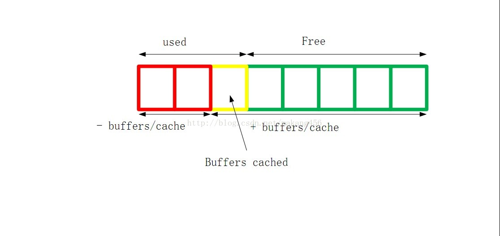

# linux常用命令

```bash
# 查看CPU核数
cat /proc/cpuinfo | grep "physical id" | sort | uniq | wc -l
lscpu

# 查看CPU型号
cat /proc/cpuinfo | grep name | sort | uniq

# 查看内存信息
free -m
cat /proc/meminfo

# 查看内核版本
uname -srm
cat /proc/version

# 查看发行版本
cat /etc/redhat-release
cat /etc/issue

```
# 内存占用

</img>

